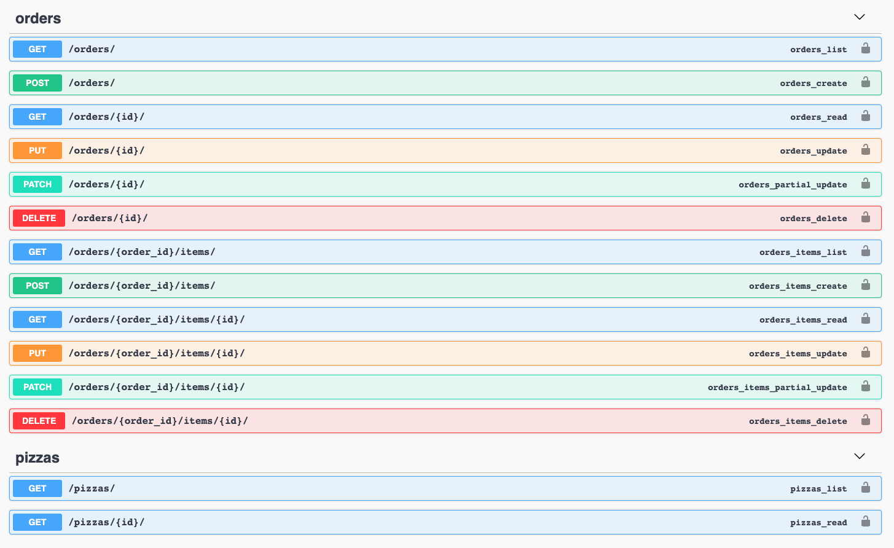

# Pizza Order Service



Table of Contents :

* [Intro](#into)  
* [Prerequisites](#prerequisites)
* [Installation](#installation)
* [Testing](#testing)


## Intro

Simplified pizza ordering services with following functionality:

* **Order pizzas:**
    * It's possible to create an order with different pizza flavors, sizes, and quantity
    * Order contains customer information (`full_name` and `email`)
    * It's also possible to order same flavor pizza in different sizes

* **Update an order:**
    * It's possible to update order items' flavor, size and quantity
    * It's possible to update delivery status/state of the order
    * If order status marked as `delivered`, then it's not possible to update neither its status nor items' details

* **Remove an order**

* **Retrieve an order:**
    * It's possible to retrieve the order by its identifier.

* **List orders:**
    * It's possible to retrieve list of orders.
    * It's also possible to filter orders by status and customer info.

---

## Prerequisites

This service assumes you know the libraries/tools listed below, and you've already installed Docker and docker-compose on your local machine:

* [Docker](https://docs.docker.com/) – used for containerizing and deployment
    * [Docker-compose](https://docs.docker.com/compose/)
* [Django](https://www.djangoproject.com/) – used as framework
* [Django REST framework](https://www.django-rest-framework.org/) – used as REST API framework
    * [DRF-extensions](http://chibisov.github.io/drf-extensions/docs/#drf-extensions) - used for nested routing
* [drf-yasg](https://drf-yasg.readthedocs.io/en/stable/index.html#) – used as Swagger Generator


---
## Installation

To run this service locally, please use commands listed below.


Clone code to the local machine:

```bash
$ git clone git@github.com:msadig/drf-api-test.git
```

Build the Docker images:

```bash
$ docker-compose build
```

Setup the project (runs migrations, collects static files, and loads initial data):

```bash
$  docker-compose run --rm setup 
```

Run the service:

```bash
$  docker-compose up -d api
```

Now, you can access the application from your browser in the addresses listed below:

* Admin: http://localhost:8015/admin/ 
    * user: `mail@muradovs.com`
    * password: `admin12345`
* Swagger: http://localhost:8015/swagger/
* Docs: http://localhost:8015/doc/
* Base API URL: http://localhost:8015/api/v1/


---

## Testing

To run tests: 

```bash
$  docker-compose run --rm test 
```

To inspect logs: 

```bash
$  docker-compose logs -f api
```


### Disclaimer:

The application was tested in a system with:

* MacBook Pro (Intel Core i7 2,7 GHz, 16 GB LPDDR3)
* MacOS Big Sur (11.2.3 (20D91))
* Docker-compose (version 1.29.0, build 07737305)
* Docker (20.10.5)